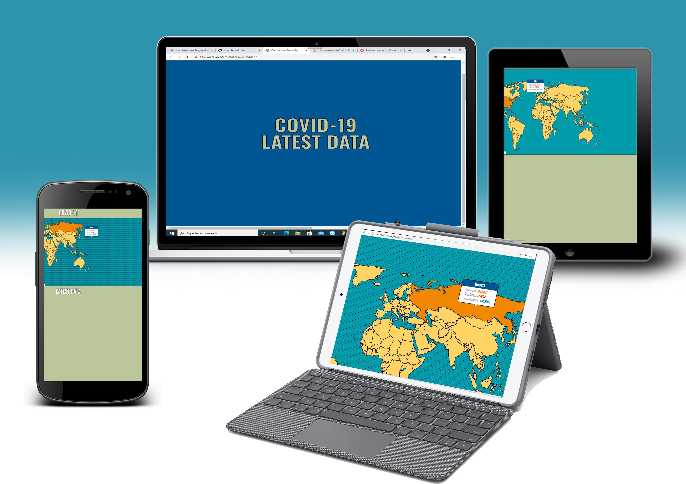
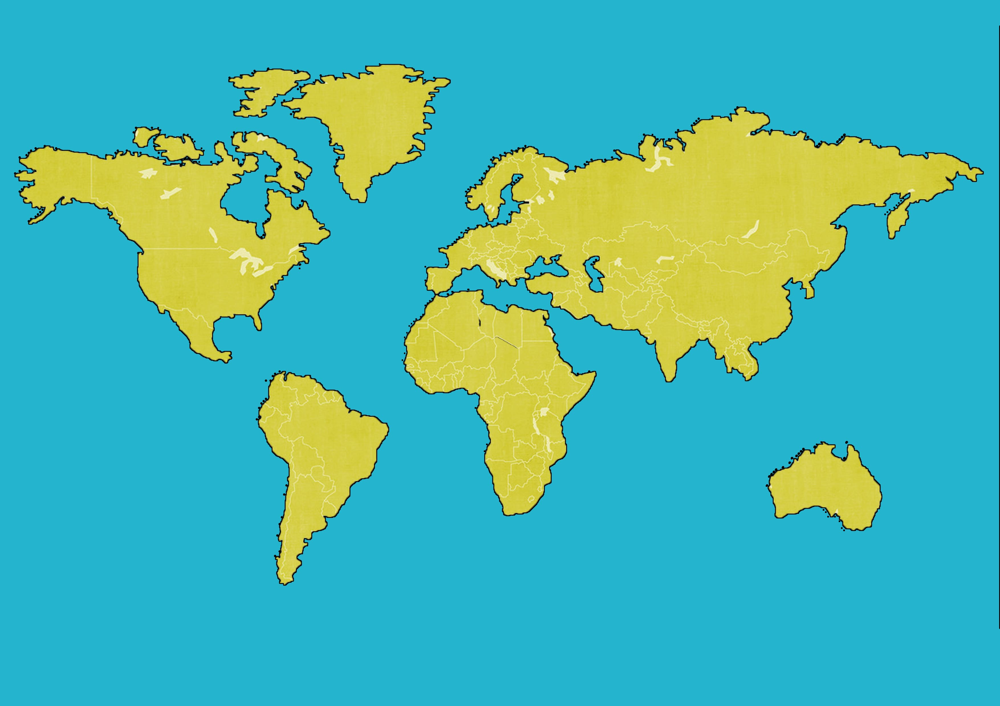
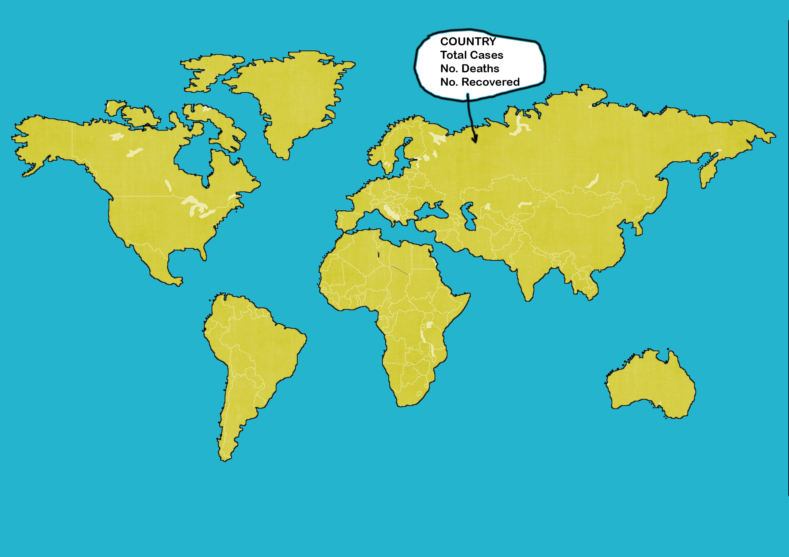

# OCHUKO EREWIVE WEBSITE

## Interactive Frontend Development Milestone Project

Ppresenting Ochuko Erewive's Interactive Frontend website. A site that can be used by anyone or age with the information about the pendemic(Covid-19) displayed just by the move of your hands or mouse. 

## Live website can be viewd in githup

#  UX

## The goal for the COVID-19 Website
+ Is to have a website that is easy to navigate through by moving your mouse.
+ To get information directly without clicking to a page or waiting too long for the display of COVID-19 data.

### USER GOALS
 NEW USER GOALS.
 + User is able to see all countries at once.
 + User is able to get all information in one place or page.
 + User is able to get any inforation of any country as regards to Covid-19 data

USER STORIES
+ Is to get all information at the tip of my hand.
+ To showcase all the Total Cases affected in a country, total death and also total recovered from the pendemic.

As a new user, you will find the total cases of people affected, howmany death and also howmany recovered from Covid.

## STRUCTURE OF THE WEBSITE
This website is user friendly to all display platforms like the Desktop computer, Laptop computer, Ipad, android phones and also apply phones. Every aspect of the site is designed to achieve maximum user satisfaction.

## WIREFRAMES
+ The wireframes were designed using corel-draw. Below is the website view on how it should look at the finished state.

COMPUTER VIEW 

## COLORS
 + World Map color: #FFD464;
  + Background color: #009CAB;

## FEATURES
+ The website has only one page to save time in retrieving data of any country of choice

## TECHNOLOGY USED
### Maps and Design
The webpage was built using HTML, CSS, and Javascript.
The map was created using SVG.

### 3rd party libraries
Examples use these thIrd party libraries:

* [SVG](http://www.w3.org/2000/svg)
* [INKSCAPE](http://www.inkscape.org/namespaces/inkscape)
* [SODIPODI](http://sodipodi.sourceforge.net/DTD/sodipodi-0.dtd)
* [FONT](https://fonts.googleapis.com/css?family=Oswald:200,400,700&display=swap)

## TESTING
This site was tested in google chrome and windows explorer brouwser.
+ Tested with DELL Computer.
+ Tested with HP Computer also.

### COMPATIBILITY TESTING
+ The website was tested across multiple virtual mobile devices browsers

## PERFORMACE TESTING

---
---
---

The website is easy to navigate and you can get the information dirrectly without a click of a mouse. Just by placing the mouse on any country the information is displayed on the screen. 

I tested this site with all mobile devices and they function just like the computer. the only defference is that with an ipad, android phone or apple phones you need to touch the country you which to view the COVID data.

I would like to say that this project is for educational purposes and can not be be used as a template for any personal use. Main aim is to build an interactive website with HTML CSS and Javascript.

---
The reason for this website is to create a Resume showcasing and selling your ability and talents of all the work you have done in the past years and also to convince any potential employer in search of a Full-Stack Developer in his/her reputable organisation. With this site, detailed past experienced work is displayed to measure one's ability.

USER GOALS

New User Goals:
+ User is able to find information about potential employee.
+ User is able to find past detailed work done.
+ User is able to see and notice the strength of potential employee.

Returning User Goals:
+ User can contact the potential employee via the form or any of the social media platforms.
+ User can learn more about the potential employee.

UER STORIES

As a business owner:
+ I would like to make myself well known in the world via the internet.
+ Mkae my information accessable to any potential business/employee.

As a new customer:
+ I will need to contact my business partner or my employee.
+ I need to check out new information or updates of business partner or employee.

As a returning customer:
+ I need to contact co-partner and also schedule meetings for future goal.
+ I would love to connect my business partner/employee to  someone else.

# Structure Of The Website

This website is user friendly  to all platforms; Desktop computer, Laptop computer, phones, Ipad, Iphones and tablets pc. Every aspect of the website is designed to achieve maximum user satisfaction.

# Wireframes
+ The wireframes were designed using corel-draw platforms. Below is the Ipad view and the mobile view of the website.

Ipad view

Mobile View

SURFACE

COLORS:
+ background color: #f7f7f7
+ Font color: #000
+ Font color: #3e3e3e
+ link Color: #DC143C

IMAGES:
+ Images used are original

## FEATURES
The website consist of four pages. Three are accessible from the navigation menu.

NAVIGATION BAR
+ The navigation bar is visible on the top of the website. It is responsive and will adapt to mobile devices.
### Navigation Scheme consist of the follow; 
+ Home
+ My Services
+ My Work
+ Contact Me

FOOTER:
The foot consist of the following pages;
+ facebook, twitter, linkedIn and youtube icon. All icon are linkable to the sign-up/home pages respectively.

# Home
+ Consister of a picture at the lefthand side and also a discribtion/title at the righthand side.

# My Services
+ Consist of applicant abilities and work efficient.

# My Work
+ Which consist of my recent work done and a little gallery display of company logos.

# Contact Me
The contact part consist of the form that requires , nammes, email address, asubject and a short message

## Technologies used:
* HTML File (.html)
* CSS File (.css)
* Bootstrap (.css)
* Font-Awesome (.css)
* Fonts (.ttf, .eot, .otf, .woff)
* Images (.png)
* Wireframe file (.jpg)

## 3rd party libraries
I used these third party libraries:
* [GOOGLE FONTS](http://fonts.googleapis.com/css?family=Open+Sans:300,400,600,700,800)

## TESTING
The site was tested in google chrom, mozilla and windows browsers.

# Compatibility testing
Site was tested across multiple virtual mobile devices and bowsers.

Tested also on hardware devices, on Dell pc and Hp pc.

# Performace testing

Code Validation

+ W3C CSS Validator to validate CSS
+ Nu Html Checker to test HTML

#  Deployment
This project was deployed in  GitHub which Gitpod is the development environment used.
I used git command to save all changes into GitHub.

To ply the project,
+ Log into GitHub and click on (MSPROJECT)
+ From the settings in GitHub, scroll down a little to the bottom of the page wher you will see "GitHub Pages.
+ from there you will see the repository address: https://ochukoerewive.github.io/msproject/

CREDITS
+ Code Institude student template was used to achieve my MS Project 1

Ideas and knowledge library:
+ w3schools.com
+ css-tricks.com
+ getbootstrap.com 

## Screen Shots

With this, i hope you can nevigate through the site

# Thank you

# the second projects

# covid-19 Data Map
OCHUKO EREWIVE WEBSITE 2

## Interactive Frontend MileStone Project
---
 # A Project of Covid-19 Data Map

This is a website presented by Ochuko Erewive. The site shows and gives upto date informations of the total cases, death and also recoveries of COVID-19.

This project is for educational purposes and can not be be used as a template for any personal use. Main aim is to build an Interactive website using HTML, CSS and Javascript.

---

## Live Website in github
---

# UX

## Website goals

## Structure of the Website

## Wireframes

## Features

## Navigation scheme

## Technology used

## 3rd party libery / API
The covid-19 data used was gotten from [this API](https://coronavirus-19-api.herokuapp.com/countries).

## Testing

## Compatibility testing

## Performance testing

## Deployment

## Screen Shots
---
# THANK YOU

A map depicting the spread of the pandemic; COVID-19, using data visualization for representation.
Created with HTML, CSS and Javascript.

Simply hover or scroll over any country to see the data. 

## Usage
download folder and open the HTML file.

## Data
### Source
The covid-19 data used was gotten from [this API](https://coronavirus-19-api.herokuapp.com/countries).

### Accuracy
Data used might not be accurate, please treat as sample data.

## Technology
### Maps and Design
The webpage was built using HTML, CSS, and Javascript.
The map was created using SVG.

### 3rd party libraries
Examples use these thord party libraries:

* [SVG](http://www.w3.org/2000/svg)
* [INKSCAPE](http://www.inkscape.org/namespaces/inkscape)
* [SODIPODI](http://sodipodi.sourceforge.net/DTD/sodipodi-0.dtd)
* [FONT](https://fonts.googleapis.com/css?family=Oswald:200,400,700&display=swap)

