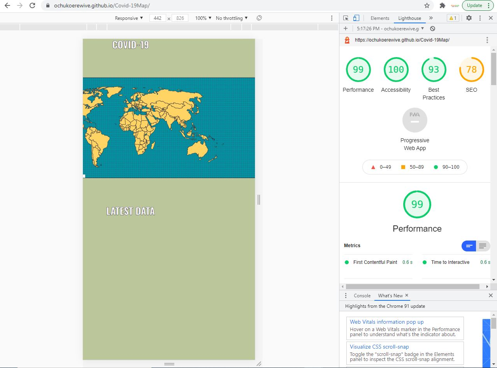
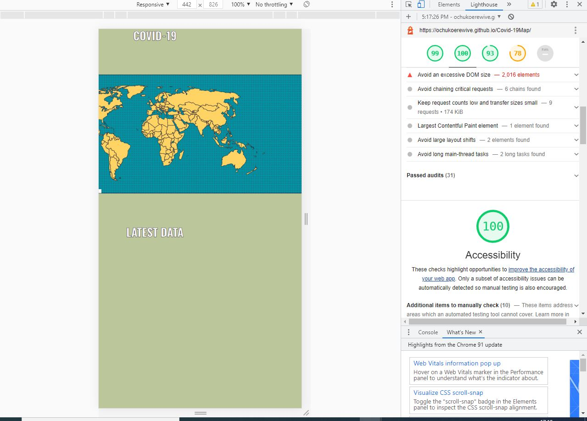
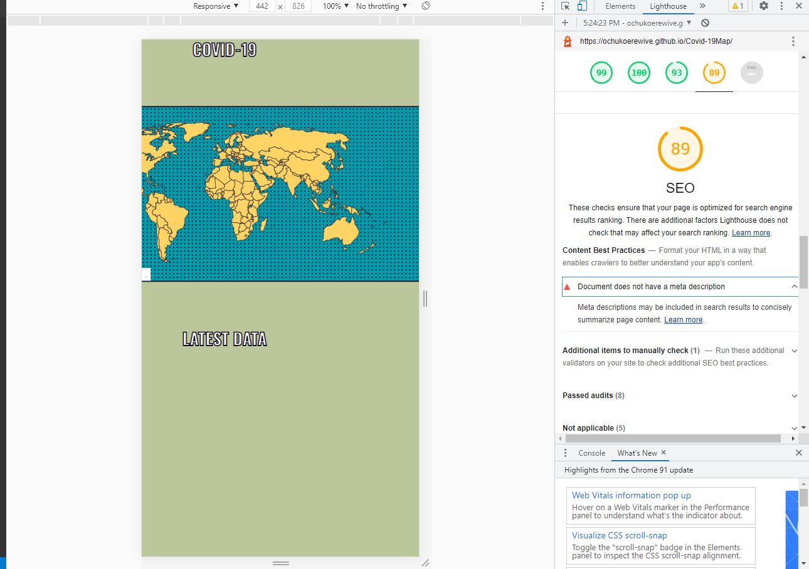

# OCHUKO EREWIVE WEBSITE

## Interactive Frontend Development Milestone Project

Ppresenting Ochuko Erewive's Interactive Frontend website. A site that can be used by anyone or age with the information about the pendemic(Covid-19) displayed just by the move of your hands or mouse. 

## Live website can be viewd in githup

#  UX

## The goal for the COVID-19 Website
+ Is to have a website that is easy to navigate through by moving your mouse.
+ To get information directly without clicking to a page or waiting too long for the display of COVID-19 data.

### USER GOALS
 NEW USER GOALS.
 + User is able to see all countries at once.
 + User is able to get all information in one place or page.
 + User is able to get any inforation of any country as regards to Covid-19 data

USER STORIES
+ Is to get all information at the tip of my hand.
+ To showcase all the Total Cases affected in a country, total death and also total recovered from the pendemic.

As a new user, you will find the total cases of people affected, howmany death and also howmany recovered from Covid.

## STRUCTURE OF THE WEBSITE
This website is user friendly to all display platforms like the Desktop computer, Laptop computer, Ipad, android phones and also apply phones. Every aspect of the site is designed to achieve maximum user satisfaction.

## WIREFRAMES
+ The wireframes were designed using corel-draw. Below is the website view on how it should look at the finished state.

COMPUTER VIEW 

## COLORS
 + World Map color: #FFD464;
  + Background color: #009CAB;

## FEATURES
+ The website has only one page to save time in retrieving data of any country of choice

## TECHNOLOGY USED
### Maps and Design
The webpage was built using HTML, CSS, and Javascript.
The map was created using SVG.

### 3rd party libraries
Examples use these thIrd party libraries:

* [SVG](http://www.w3.org/2000/svg)
* [INKSCAPE](http://www.inkscape.org/namespaces/inkscape)
* [SODIPODI](http://sodipodi.sourceforge.net/DTD/sodipodi-0.dtd)
* [FONT](https://fonts.googleapis.com/css?family=Oswald:200,400,700&display=swap)

## TESTING
This site was tested in google chrome and windows explorer brouwser.
+ Tested with DELL Computer.
+ Tested with HP Computer also.

### COMPATIBILITY TESTING
+ The website was tested across multiple virtual mobile devices browsers

## PERFORMANCE TESTING

Our aim is to make the data information available with just a click of the mouse.

### Thank you